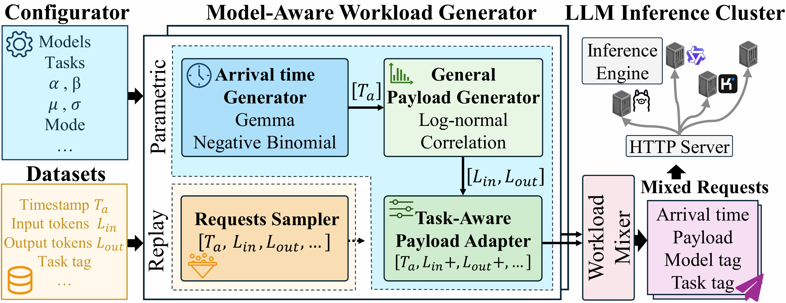

# FineServe

FineServe is an in-the-wild, multi-model LLM serving workload dataset collected from a global commercial marketplace. It enables fine-grained characterization of real-world serving dynamics across heterogeneous models and tasks, and provides a workload generator for benchmarking multi-model serving platforms.

## Architecture

<div align="center">
  
</div>

## Key Features

- **Realistic workloads**: derived from real-world, multi-model LLM serving traces (desensitized).
- **Fine-grained control**: configurable request arrival patterns and token-length behaviors for benchmarking.
- **Two generation modes**:
  - **Replay**: directly replay desensitized traces collected from real systems.
  - **Parametric**: synthesize workloads from statistical parameters to generate workloads at arbitrary scale.

## Repository Layout

```text
FineServe/
├─ Generator.py                  # Workload generator & benchmark runner
├─ datasets/
│  ├─ replay/                    # Real trace CSVs
│  └─ Parametric/               # Parametric workload configurations
│     ├─ cv/                    # Per-window gamma parameters
│     └─ nb/                    # Example parameter files (e.g., NB)
├─ README.md
```

## Replay Trace Format

In replay mode, FineServe consumes a CSV file that records desensitized request traces. Each row corresponds to a single request and captures both token-level characteristics and metadata.

### Field Description

- **input_length (int)**  
  Number of input tokens.

- **output_length (int)**  
  Number of generated tokens.

- **latency (float)**  
  Observed request latency in seconds.  

- **timestamp (float)**  
  Arrival time of the request (in milliseconds).  
  This is a relative timestamp, where the first request typically starts at `t = 0.0`.

- **architecture (string)**  
  Model architecture type, e.g., `Dense` or `MoE`.

- **scale (string)**  
  Model size category, e.g., `<10B`, `10to30B`, `30to100B`, `>100B`.

### Example

| input_length | output_length | latency | timestamp  | architecture | scale |
|-------------|--------------|--------|------------|-------------|-------|
| 631         | 64           | 0.0021 | 0.0        | MoE         | >100B |
| 763         | 160          | 0.0022 | 5799279.0  | MoE         | >100B |
| 2794        | 80           | 0.0012 | 5827389.0  | MoE         | >100B |
| 4766        | 403          | 0.0013 | 5828345.0  | MoE         | >100B |
| 5484        | 125          | 0.0013 | 5851573.0  | MoE         | >100B |

### Notes

- Requests are replayed based on **inter-arrival gaps derived from `timestamp`**.
- Only `input_length`, `output_length`, and `timestamp` are required for replay.
- Additional fields (e.g., `latency`, `architecture`, `scale`) are optional and mainly used for analysis, filtering, or stratified workload generation.


## Quick Start

### Requirements

- Python 3.9+
- A serving backend compatible with the OpenAI Completions API (e.g., vLLM)

### Basic Arguments

- `--backend`: backend type (`vllm`)
- `--host`, `--port`: serving endpoint
- `--model`: model path
- `--tokenizer`: tokenizer path
- `--dataset-path`: prompt source dataset 
- `--mode`: request generation mode (`poisson`, `replay`, or `parametric`)

---

### 1) Poisson mode

Poisson mode generates requests according to a Poisson arrival process with request rate `--request-rate` (req/s). Prompts are sampled from the dataset specified by `--dataset-path`.

```bash
python Generator.py \
  --backend vllm \
  --host 127.0.0.1 \
  --port 8000 \
  --mode poisson \
  --request-rate 50 \
  --dataset-path "/path/to/dataset" \
  --model "your-model-path" \
  --tokenizer "your-tokenizer-path" \
  --num-prompts 1000
```

---

### 2) Replay mode

Replay mode replays request arrivals from a CSV trace. The generator replays arrival times from `timestamp`, while prompt lengths and output lengths are controlled by the trace.

```bash
python Generator.py \
  --backend vllm \
  --host 127.0.0.1 \
  --port 8000 \
  --mode replay \
  --request-trace-csv "datasets/replay/Dense_10to30B.csv" \
  --time-scale 1.0 \
  --dataset-path "/path/to/dataset" \
  --model "your-model-path" \
  --tokenizer "your-tokenizer-path"
```

**Optional replay arguments**

- `--timestamp-column` (default: `timestamp`)
- `--input-length-column` (default: `input_length`)
- `--output-length-column` (default: `output_length`)
- `--time-scale` (default: 1.0)  
  Controls time compression of the replay trace.  
  A larger value compresses inter-arrival intervals, resulting in higher effective request rate and increased concurrency.

---

### 3) Parametric mode

Parametric mode synthesizes request arrivals from per-window Gamma parameters. Optionally, request lengths can also be loaded from a separate CSV.

```bash
python Generator.py \
  --backend vllm \
  --host 127.0.0.1 \
  --port 8000 \
  --mode parametric \
  --gamma-params-csv "datasets/cv/example_gamma.csv" \
  --request-lengths-csv "datasets/replay/example_lengths.csv" \
  --dataset-path "/path/to/dataset" \
  --model "your-model-path" \
  --tokenizer "your-tokenizer-path" \
  --num-prompts 1000
```

**Required parametric arguments**

- `--gamma-params-csv`: CSV file containing Gamma parameters

**Optional parametric arguments**

- `--request-lengths-csv`: CSV file containing `input_length` and `output_length`

---

### 5) Notes

- In `poisson` mode, request arrivals are controlled by `--request-rate`.
- In `replay` mode, request arrivals are driven by the timestamps in `--request-trace-csv`.
- In `parametric` mode, arrivals are synthesized from Gamma parameters loaded from `--gamma-params-csv`.
- Prompts are always sourced from `--dataset-path`, while request lengths and arrival patterns depend on the selected mode.
```