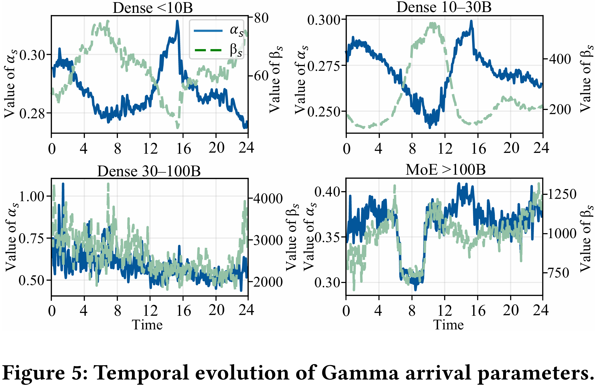

# Request Arrival Modeling

FineServe models request arrivals in `parametric` mode using a **two-layer design**:

1. **Gamma layer** → controls inter-arrival timing at window level  
2. **NB layer** → controls micro-burst  

This design allows FineServe to reproduce both:

- long-term traffic patterns (e.g., daily cycles)
- short-term high concurrency (bursty arrivals)


## 1. Gamma (Inter-Arrival Timing)

- Each parameter row corresponds to one time window (default: `300s`)
- Request intervals are generated from:
  - `gamma_shape`
  - `gamma_scale` (milliseconds)

Gamma controls **when requests arrive**

---

### Gamma Parameter File

Location:

```
datasets/Parametric/gamma/
```

FineServe provides **Gamma parameters** derived from 4 months real-world serving traces.

- Covers **4 model categories**:
  - Dense <10B
  - Dense 10–30B
  - Dense 30–100B
  - MoE >100B

Each row represents the **average arrival pattern within a 5-minute window**

<div align="center">
  
</div>

### Gamma Extension Modes

FineServe supports two ways to extend Gamma parameters to longer workloads:

#### `repeat_jitter` (default)

- Repeats windows cyclically
- Preserves periodic patterns (e.g., daily tidal behavior)
- Adds multiplicative perturbation (`--parametric-jitter-ratio`)

Best for:

- workloads with clear periodicity  
- realistic replay-like simulation  
- reproducible benchmarking  


#### `model_sample`

- Fits a global Gaussian in log-space:

  \[
  [\log(\text{shape}), \log(\text{scale})] \sim \mathcal{N}(\mu, \Sigma)
  \]

- Samples new `(shape, scale)` for each window

Best for:

- long-duration simulation  
- dynamic / non-periodic workloads  
- diversity generation  

---


## 2. NB (Micro-Burst Control)

Gamma controls *when* requests arrive, while NB controls *how many* requests arrive at the same time.

Gamma-based modeling generates arrivals sequentially, which effectively limits each time slot to at most one request after discretization.

However, real-world traces show that:

- multiple requests can arrive within the same time slot  
- high concurrency is common in certain workloads (especially `lt10B`)

To capture this behavior, FineServe introduces a **Negative Binomial (NB) layer**.

At each time slot, NB determines how many requests are emitted.


### NB Parameter File

Location:

```
datasets/Parametric/nb/
```

FineServe provides NB parameters for burst-dominant workloads:

- Currently available for:
  - Dense <10B

This reflects that strong micro-burst behavior is primarily observed in this category.


### NB Enablement (Current Behavior)

- NB is **auto-enabled for `lt10B` workloads**
- Disabled for other categories by default (due to low burst intensity)

Override options:

- Disable:
  ```
  --disable-parametric-nb-lt10b
  ```

- Manually specify:
  ```
  --parametric-nb-json path/to/file.json
  ```

